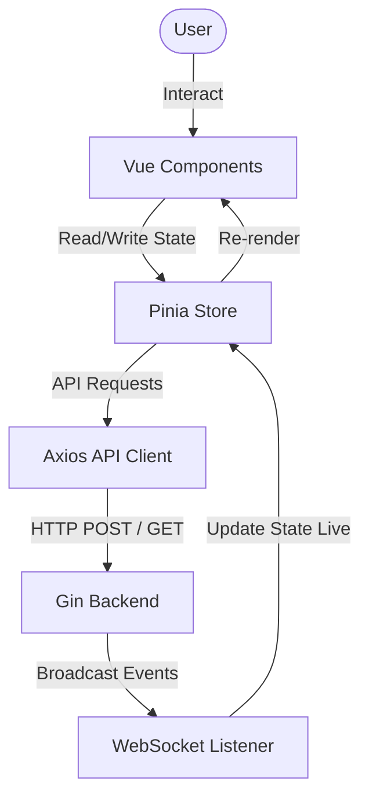

# Cinema Ticket Booking System - Frontend

โปรเจกต์ Frontend สำหรับระบบจองตั๋วโรงภาพยนตร์ (Take-Home Assignment) พัฒนาด้วย Vue 3 (Composition API) เน้นการสร้าง UI ที่ใช้งานง่าย, มีความสวยงามทันสมัย (Dark Theme), และรองรับการทำงานแบบ Real-time ผ่าน WebSocket

---

## 📁 Frontend Project Layout

```text
cinema-frontend/
├── src/
│   ├── api/            # การเชื่อมต่อ HTTP Client (Axios) และ Interceptor (แนบ Token)
│   ├── assets/         # ไฟล์รูปภาพหรือ Global CSS (เช่น index.css สำหรับ Tailwind)
│   ├── components/     # UI Components ที่นำไปใช้ซ้ำได้
│   │   ├── SeatMap.vue    # ผังที่นั่ง
│   │   ├── ActionPanel.vue # แผงควบคุมการจอง/ชำระเงิน
│   │   └── SystemLogs.vue  # แถบแสดง Log การทำงานแบบ Real-time
│   ├── stores/         # State Management (Pinia)
│   │   ├── auth.ts        # จัดการข้อมูลผู้ใช้และ JWT
│   │   └── booking.ts     # จัดการข้อมูลผังที่นั่ง, การล็อก และ WebSocket
│   ├── views/          # หน้าจอหลัก (Pages)
│   │   ├── LoginView.vue      # หน้าล็อกอิน
│   │   ├── BookingView.vue    # หน้าจองตั๋วสำหรับ User
│   │   └── AdminDashboard.vue # แดชบอร์ดสำหรับ Admin
│   ├── App.vue         # Root Component
│   └── main.ts         # Entry Point ของ Vue App
├── .env
├── vite.config.ts      # การตั้งค่า Vite (รวมถึง Proxy ไปหา Backend)
└── Dockerfile
```

---

## 1. System Architecture Diagram (Frontend Perspective)



---

## 2. Tech Stack Overview

- **Framework:** Vue 3 (Composition API / `<script setup>`)
- **Build Tool:** Vite (เพื่อการ Build ที่รวดเร็วและรองรับ HMR)
- **Language:** TypeScript (เพิ่ม Type Safety ให้กับการเขียนโค้ด)
- **State Management:** Pinia (จัดการ State ส่วนกลางของระบบ)
- **Routing:** Vue Router (จัดการการเปลี่ยนหน้าแบบ SPA)
- **Styling:** Tailwind CSS (สร้าง UI แบบ Utility-first พร้อมดีไซน์ Dark Mode สมัยใหม่)
- **Network Request:** Axios (สำหรับเรียก API) และ Native WebSocket API

---

## 3. Booking Flow (ในมุมมองของ Frontend)

1. **Movie Selection:** ผู้ใช้เลือกภาพยนตร์ผ่าน Dropdown ใน `BookingView.vue` ทำให้ Pinia เรียก `GET /seats`
2. **Seat Selection:** ผู้ใช้คลิกที่นั่งที่เป็นสถานะ `AVAILABLE` ระบบจะเปลี่ยนเป็นสถานะ **"เลือก"** (Selected) 
3. **Lock Seat:** ผู้ใช้กดปุ่ม "ล็อกที่นั่ง" -> เรียก `POST /seats/lock` -> หากสำเร็จ Frontend จะจดจำไว้ว่าที่นั่งนี้เป็นของตนเอง
4. **Real-time Sync:** เมื่อมีคนจองหรือล็อกที่นั่ง WebSocket จะส่ง Event กลับมาที่ Client ทันที Pinia Store จะทำการอัปเดตอาร์เรย์ของที่นั่ง ส่งผลให้ UI ของทุกคนเปลี่ยนสีพร้อมกันโดยไม่ต้องกดรีเฟรช
5. **Payment:** ผู้ใช้กด "ไปที่หน้าชำระเงิน" ระบบจะเรียก `POST /seats/confirm` หากผ่าน ที่นั่งจะกลายเป็นสถานะ `BOOKED` อย่างสมบูรณ์แบบ

---

## 4. State Management Strategy (ทำไมถึงใช้ Pinia)

ระบบจองตั๋วมีความซับซ้อนของการแชร์ข้อมูลระหว่าง Component สูงมาก (เช่น `ActionPanel` ต้องรู้ว่า `SeatMap` เลือกที่นั่งไหนอยู่ และ `SystemLogs` ต้องดึงข้อความจาก Action ไปแสดงผล)
- การใช้ **Pinia Store (`booking.ts`)** ทำให้เราสามารถเก็บสถานะ `seats`, `selectedSeat`, และการเชื่อมต่อ `WebSocket` ไว้ตรงกลาง 
- Components เพียงแค่อ่านและเขียนข้อมูลลง Store เท่านั้น ลดความซับซ้อนของการส่ง Props และ Emit ลงได้อย่างมหาศาล

---

## 5. Real-time Strategy (WebSocket)

- แทนที่จะใช้การ Polling (เรียก API ทุกๆ 3 วินาที) ซึ่งเปลืองทรัพยากร Frontend จะเปิดการเชื่อมต่อ WebSocket ไปหา Backend ตั้งแต่โหลดหน้าเว็บ
- เมื่อมีการอัปเดต ข้อมูลที่ส่งมาเป็น JSON จะถูกนำไปทับ (Map) ในตัวแปร `seats` ใน Pinia ทันที
- **Auto Reconnect:** หาก Server ดับหรือเน็ตหลุด ได้มีการเขียนดัก `ws.onclose` ให้ Frontend พยายามเชื่อมต่อใหม่ (Reconnect) อัตโนมัติทุกๆ 3 วินาที

---

## 6. วิธีรันระบบ

**รันร่วมกับ Backend (ผ่าน Docker):**
```bash
docker compose up -d --build
```
*Frontend จะรันอยู่ที่: `http://localhost:5173`*

**รันแยกแบบ Local Development (ต้องการ Node.js):**
```bash
cd cinema-frontend
npm install
npm run dev
```

---

## 7. Assumptions & Trade-offs

- **UI Feedback:** เลือกใช้ `alert()` ผสมกับการแสดงข้อความ Log ในหน้าจอ (System Logs) แทนการลงไลบรารี Toast แจ้งเตือนแบบซับซ้อน เพื่อลดความหนักของตัวแปรเสริม (Dependencies) ลง
- **Admin Security:** มีการตรวจเช็กเงื่อนไขการเป็น Admin ทั้งในระดับ Frontend (`authStore.isAdmin`) เพื่อไม่ให้ปุ่มเมนูโชว์ขึ้นมา และระดับ Router เพื่อป้องกันคนพิมพ์ URL `/admin` ตรงๆ หากไม่มีสิทธิ์จะถูกเด้งกลับหน้าแรกทันที

---

## 8. วิธีการทดสอบบน Frontend

- **การทดสอบความ Real-time:** 
  ให้ทำการเปิดหน้าต่างเบราว์เซอร์ **2 หน้าจอ (จอปกติ และ Incognito)** ล็อกอินด้วยบัญชีที่ต่างกัน
  หากหน้าต่าง A กดล็อกที่นั่ง หน้าต่าง B จะต้องเห็นที่นั่งนั้นเปลี่ยนเป็นสีส้มในทันทีโดยไม่ต้องกดรีเฟรชหน้าเว็บ
- **การทดสอบ UI / UX Validation:**
  เมื่อที่นั่งถูกล็อกหรือถูกซื้อไปแล้ว จะต้องมีสถานะเมาส์เป็น `cursor-not-allowed` และคลิกไม่ไป
- **การทดสอบ Filter (Admin):**
  ในหน้า Admin Dashboard ให้ทดลองใช้ Select Box เพื่อกรองสถานะ (Status) หรือเรื่องของภาพยนตร์เพื่อดูการเปลี่ยนแปลงข้อมูลในตาราง

---

## 9. Key Frontend Features

1. **Secure Routes:** มีการทำ Router Guard ควบคุมสิทธิ์การเข้าถึง (`/`, `/login`, `/admin`)
2. **Axios Interceptors:** แนบ JWT Token (`Bearer ...`) ไปกับทุกๆ HTTP Request ให้อัตโนมัติ และจะทำการเตะผู้ใช้ออกจากระบบไปหน้าล็อกอิน หาก Token หมดอายุหรือเซิร์ฟเวอร์ตอบกลับ 401 Unauthorized
3. **Responsive Design:** รองรับการแสดงผลทั้งบนโทรศัพท์มือถือและหน้าจอ Desktop ผ่าน Tailwind Grid/Flexbox
4. **Dynamic Data Table:** ระบบตารางฝั่ง Admin ที่ผูกข้อมูล (Data Binding) พร้อมฟังก์ชันการแปลงวันที่ (Format Date) ให้เป็นรูปแบบที่มนุษย์อ่านเข้าใจง่าย

---

## 10. Design & Aesthetics

- **Dark Theme Palette:** ใช้โทนสี `bg-slate-950` เป็นพื้นหลังเพื่อความลุ่มลึก สบายตาเวลาอยู่ในสภาพแวดล้อมมืดคล้ายกับการเดินเข้าโรงภาพยนตร์
- **Color Coding:**
  - `Emerald (เขียว)`: เป็นตัวแทนของ (Available, Booked by Me)
  - `Amber (ส้ม/เหลือง)`: เป็นตัวแทนของ (Locked)
  - `Red (แดง)`: เป็นตัวแทนของการกระทำที่ผิดพลาด ลบข้อมูล หรือที่นั่งถูกผู้อื่นซื้อไปแล้ว (Unavailable)
- **Micro-interactions:** มีการใส่ Transition การ Hover เช่น `hover:bg-slate-600` หรือปุ่มมีสเกลขึ้นเล็กน้อย (`scale-105`) เพื่อให้ผู้ใช้รู้สึกว่าระบบโต้ตอบกับการคลิกของตนเองตลอดเวลา
